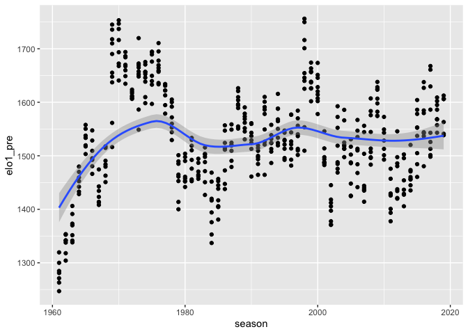

**IDEAS**
*We can compare ticket sale, merch sale, attendance, players, player pay, aggressive-ness, etc for womens and mens soccer.*
*We can explore one sport fully and look at how many people watch the game live in the stadium, which game had the highest attendance,Who is the most experienced player in the game, What’s the winning rate for each team, What’s the relationship between aggressive behaviors and the winning rate.*

```r
library(readr)
library(tidyverse)
```

```
## ── Attaching packages ────────────────────────────────────────────────────────── tidyverse 1.2.1 ──
```

```
## ✔ ggplot2 3.2.1     ✔ purrr   0.3.2
## ✔ tibble  2.1.3     ✔ dplyr   0.8.3
## ✔ tidyr   1.0.0     ✔ stringr 1.4.0
## ✔ ggplot2 3.2.1     ✔ forcats 0.4.0
```

```
## ── Conflicts ───────────────────────────────────────────────────────────── tidyverse_conflicts() ──
## ✖ dplyr::filter() masks stats::filter()
## ✖ dplyr::lag()    masks stats::lag()
```

```r
library(lubridate)
```

```
## 
## Attaching package: 'lubridate'
```

```
## The following object is masked from 'package:base':
## 
##     date
```

```r
library(ggmap)
```

```
## Google's Terms of Service: https://cloud.google.com/maps-platform/terms/.
```

```
## Please cite ggmap if you use it! See citation("ggmap") for details.
```

```r
library(babynames)
library(plotly)
```

```
## 
## Attaching package: 'plotly'
```

```
## The following object is masked from 'package:ggmap':
## 
##     wind
```

```
## The following object is masked from 'package:ggplot2':
## 
##     last_plot
```

```
## The following object is masked from 'package:stats':
## 
##     filter
```

```
## The following object is masked from 'package:graphics':
## 
##     layout
```

```r
library(gganimate) 
library(gifski) 
```


```r
nfl_elo <- read_csv("https://projects.fivethirtyeight.com/nfl-api/nfl_elo.csv")
```

```
## Parsed with column specification:
## cols(
##   .default = col_logical(),
##   date = col_date(format = ""),
##   season = col_double(),
##   neutral = col_double(),
##   team1 = col_character(),
##   team2 = col_character(),
##   elo1_pre = col_double(),
##   elo2_pre = col_double(),
##   elo_prob1 = col_double(),
##   elo_prob2 = col_double(),
##   elo1_post = col_double(),
##   elo2_post = col_double(),
##   score1 = col_double(),
##   score2 = col_double()
## )
```

```
## See spec(...) for full column specifications.
```

```
## Warning: 229506 parsing failures.
##  row     col           expected actual                                                       file
## 1054 playoff 1/0/T/F/TRUE/FALSE      c 'https://projects.fivethirtyeight.com/nfl-api/nfl_elo.csv'
## 1115 playoff 1/0/T/F/TRUE/FALSE      c 'https://projects.fivethirtyeight.com/nfl-api/nfl_elo.csv'
## 1169 playoff 1/0/T/F/TRUE/FALSE      c 'https://projects.fivethirtyeight.com/nfl-api/nfl_elo.csv'
## 1224 playoff 1/0/T/F/TRUE/FALSE      c 'https://projects.fivethirtyeight.com/nfl-api/nfl_elo.csv'
## 1280 playoff 1/0/T/F/TRUE/FALSE      c 'https://projects.fivethirtyeight.com/nfl-api/nfl_elo.csv'
## .... ....... .................. ...... ..........................................................
## See problems(...) for more details.
```


```r
nfl_elo %>% 
  filter(team1 == "MIN") %>% 
  arrange(desc(elo1_pre)) %>% 
  
  ggplot(aes(y = elo1_pre, x = season))+
  geom_point() +
  geom_smooth()
```

```
## `geom_smooth()` using method = 'loess' and formula 'y ~ x'
```

<!-- -->

Questions for Research:

What does "elo1_pre" mean? We assume it is a metric five thirty eight loses for their NFL predictions

What caused the peaks and valleys in the trends? Clearly at their conception, the team started off slowly in terms of the elo1_pre.

How does attendance for games relate to elo1_pre?

How accurate are the predictions? We can compare the metrics with their win and lose record?


```r
nfl_elo_MIN <- nfl_elo %>% 
  filter(team1 == "MIN") %>% 
  group_by(season) %>% 
  summarise(total_score = sum(score1)) %>% 
  
   ggplot(aes(y = total_score, x = season))+
  geom_point()+
  geom_line()
```

```r
ggplotly(nfl_elo_MIN)
```

<!--html_preserve--><div id="htmlwidget-f1faa4d05230921c5e15" style="width:672px;height:480px;" class="plotly html-widget"></div>
<script type="application/json" data-for="htmlwidget-f1faa4d05230921c5e15">{"x":{"data":[{"x":[1961,1962,1963,1964,1965,1966,1967,1968,1969,1970,1971,1972,1973,1974,1975,1976,1977,1978,1979,1980,1981,1982,1983,1984,1985,1986,1987,1988,1989,1990,1991,1992,1993,1994,1995,1996,1997,1998,1999,2000,2001,2002,2003,2004,2005,2006,2007,2008,2009,2010,2011,2012,2013,2014,2015,2016,2017,2018,2019],"y":[148,101,183,183,188,156,136,139,296,184,123,135,192,195,213,208,142,129,151,174,169,140,161,127,190,224,210,244,227,211,143,172,148,192,194,159,178,350,237,252,178,204,234,198,184,147,203,188,296,140,190,210,187,175,210,177,227,176,null],"text":["season: 1961<br />total_score: 148","season: 1962<br />total_score: 101","season: 1963<br />total_score: 183","season: 1964<br />total_score: 183","season: 1965<br />total_score: 188","season: 1966<br />total_score: 156","season: 1967<br />total_score: 136","season: 1968<br />total_score: 139","season: 1969<br />total_score: 296","season: 1970<br />total_score: 184","season: 1971<br />total_score: 123","season: 1972<br />total_score: 135","season: 1973<br />total_score: 192","season: 1974<br />total_score: 195","season: 1975<br />total_score: 213","season: 1976<br />total_score: 208","season: 1977<br />total_score: 142","season: 1978<br />total_score: 129","season: 1979<br />total_score: 151","season: 1980<br />total_score: 174","season: 1981<br />total_score: 169","season: 1982<br />total_score: 140","season: 1983<br />total_score: 161","season: 1984<br />total_score: 127","season: 1985<br />total_score: 190","season: 1986<br />total_score: 224","season: 1987<br />total_score: 210","season: 1988<br />total_score: 244","season: 1989<br />total_score: 227","season: 1990<br />total_score: 211","season: 1991<br />total_score: 143","season: 1992<br />total_score: 172","season: 1993<br />total_score: 148","season: 1994<br />total_score: 192","season: 1995<br />total_score: 194","season: 1996<br />total_score: 159","season: 1997<br />total_score: 178","season: 1998<br />total_score: 350","season: 1999<br />total_score: 237","season: 2000<br />total_score: 252","season: 2001<br />total_score: 178","season: 2002<br />total_score: 204","season: 2003<br />total_score: 234","season: 2004<br />total_score: 198","season: 2005<br />total_score: 184","season: 2006<br />total_score: 147","season: 2007<br />total_score: 203","season: 2008<br />total_score: 188","season: 2009<br />total_score: 296","season: 2010<br />total_score: 140","season: 2011<br />total_score: 190","season: 2012<br />total_score: 210","season: 2013<br />total_score: 187","season: 2014<br />total_score: 175","season: 2015<br />total_score: 210","season: 2016<br />total_score: 177","season: 2017<br />total_score: 227","season: 2018<br />total_score: 176","season: 2019<br />total_score:  NA"],"type":"scatter","mode":"markers+lines","marker":{"autocolorscale":false,"color":"rgba(0,0,0,1)","opacity":1,"size":5.66929133858268,"symbol":"circle","line":{"width":1.88976377952756,"color":"rgba(0,0,0,1)"}},"hoveron":"points","showlegend":false,"xaxis":"x","yaxis":"y","hoverinfo":"text","line":{"width":1.88976377952756,"color":"rgba(0,0,0,1)","dash":"solid"},"frame":null}],"layout":{"margin":{"t":26.2283105022831,"r":7.30593607305936,"b":40.1826484018265,"l":43.1050228310502},"plot_bgcolor":"rgba(235,235,235,1)","paper_bgcolor":"rgba(255,255,255,1)","font":{"color":"rgba(0,0,0,1)","family":"","size":14.6118721461187},"xaxis":{"domain":[0,1],"automargin":true,"type":"linear","autorange":false,"range":[1958.1,2021.9],"tickmode":"array","ticktext":["1960","1980","2000","2020"],"tickvals":[1960,1980,2000,2020],"categoryorder":"array","categoryarray":["1960","1980","2000","2020"],"nticks":null,"ticks":"outside","tickcolor":"rgba(51,51,51,1)","ticklen":3.65296803652968,"tickwidth":0.66417600664176,"showticklabels":true,"tickfont":{"color":"rgba(77,77,77,1)","family":"","size":11.689497716895},"tickangle":-0,"showline":false,"linecolor":null,"linewidth":0,"showgrid":true,"gridcolor":"rgba(255,255,255,1)","gridwidth":0.66417600664176,"zeroline":false,"anchor":"y","title":{"text":"season","font":{"color":"rgba(0,0,0,1)","family":"","size":14.6118721461187}},"hoverformat":".2f"},"yaxis":{"domain":[0,1],"automargin":true,"type":"linear","autorange":false,"range":[88.55,362.45],"tickmode":"array","ticktext":["100","150","200","250","300","350"],"tickvals":[100,150,200,250,300,350],"categoryorder":"array","categoryarray":["100","150","200","250","300","350"],"nticks":null,"ticks":"outside","tickcolor":"rgba(51,51,51,1)","ticklen":3.65296803652968,"tickwidth":0.66417600664176,"showticklabels":true,"tickfont":{"color":"rgba(77,77,77,1)","family":"","size":11.689497716895},"tickangle":-0,"showline":false,"linecolor":null,"linewidth":0,"showgrid":true,"gridcolor":"rgba(255,255,255,1)","gridwidth":0.66417600664176,"zeroline":false,"anchor":"x","title":{"text":"total_score","font":{"color":"rgba(0,0,0,1)","family":"","size":14.6118721461187}},"hoverformat":".2f"},"shapes":[{"type":"rect","fillcolor":null,"line":{"color":null,"width":0,"linetype":[]},"yref":"paper","xref":"paper","x0":0,"x1":1,"y0":0,"y1":1}],"showlegend":false,"legend":{"bgcolor":"rgba(255,255,255,1)","bordercolor":"transparent","borderwidth":1.88976377952756,"font":{"color":"rgba(0,0,0,1)","family":"","size":11.689497716895}},"hovermode":"closest","barmode":"relative"},"config":{"doubleClick":"reset","showSendToCloud":false},"source":"A","attrs":{"1649392bc62b":{"x":{},"y":{},"type":"scatter"},"164968df4e5f":{"x":{},"y":{}}},"cur_data":"1649392bc62b","visdat":{"1649392bc62b":["function (y) ","x"],"164968df4e5f":["function (y) ","x"]},"highlight":{"on":"plotly_click","persistent":false,"dynamic":false,"selectize":false,"opacityDim":0.2,"selected":{"opacity":1},"debounce":0},"shinyEvents":["plotly_hover","plotly_click","plotly_selected","plotly_relayout","plotly_brushed","plotly_brushing","plotly_clickannotation","plotly_doubleclick","plotly_deselect","plotly_afterplot"],"base_url":"https://plot.ly"},"evals":[],"jsHooks":[]}</script><!--/html_preserve-->


Questions for further Research:

We plotted the total scoring of the team per season, and we can look at why the trends occured the way they did.

How does attendence relate to the total scores for each season?

It would also be benefical to exmaine socring differential. 


